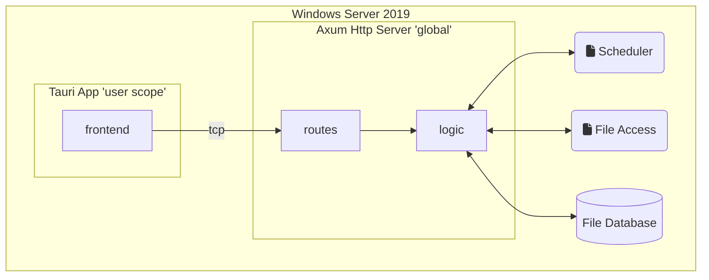

<h1 align="center">EH File Version Monitor</h1>
Checks files and services for version change on a windows machine.

<br/>

# Architecture

This application is developed as a Tauri app. Due to the need to run the application on server boot (without a user logged in), there is a small webserver, which communicates with the Tauri app.



# Application Installation on Windows Server 2019

## Global WebView2 setup

Globally install WebView2. Tauri uses it to run and display the frontend code. Download and install it from [here](https://developer.microsoft.com/en-us/microsoft-edge/webview2/#download-section). Install it for all users.

## Application Installation

> Under construction...

The main application can be installed with the delivered `.msi` file. To run the backend http server on server boot, the installed `.exe` needs to be added as a Windows task and executed on server boot. Don't forget to run the task even no user is logged in.

## Uninstall application

> Under construction...

The Windows task needs to be deleted manually. Afterwards, the application can be uninstalled normally.

# Project Setup

> ⚠ Please note that Windows .msi installers can only be created on Windows as cross-compilation doesn't work yet. Track progress [here](https://tauri.app/v1/guides/building/cross-platform).

## Tauri Prerequisites

Check [Tauri prerequisites for Windows](https://tauri.app/v1/guides/getting-started/prerequisites#setting-up-windows).

This will guide you through the necessary prerequisites installations.

1. Microsoft Visual Studio C++ Build Tools
2. WebView2 (Preinstalled in Windows 11)
3. Rust

## Nuxt initial setup

Required prerequisites for Nuxt. Check detailed instructions [here](https://v3.nuxtjs.org/getting-started/installation#prerequisites).

1. Node.js
2. VS Code Volar Extension

Install node dependencies.

```bash
npm install
```

## Development Application

### Windows application
Start the application on your local machine with HMR feature enabled for frontend and backend.

```bash
npm run tauri dev
```

### Backend web server

Cargo:
```bash
cargo tauri dev -- -- -s
```
npm:
```bash
npm run tauri dev -- -- -- -s
```

## Production

Build the application for production:

```bash
npm run tauri build
```
